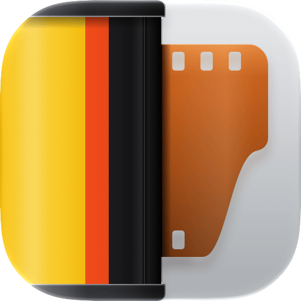
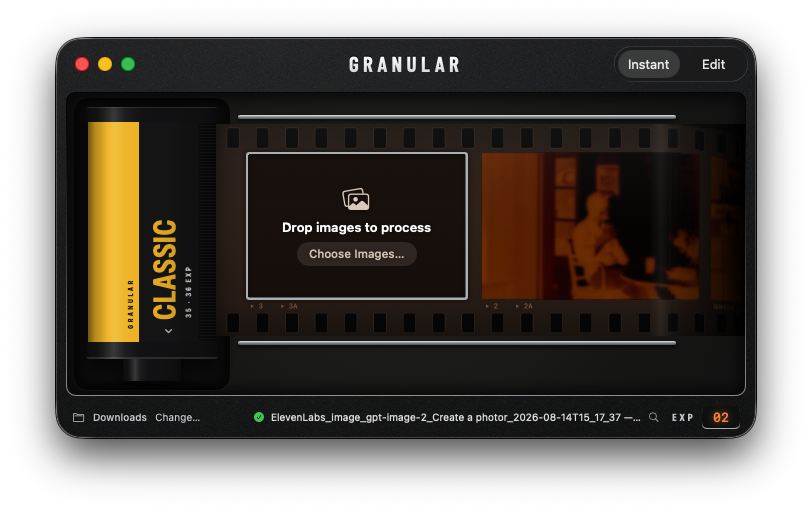
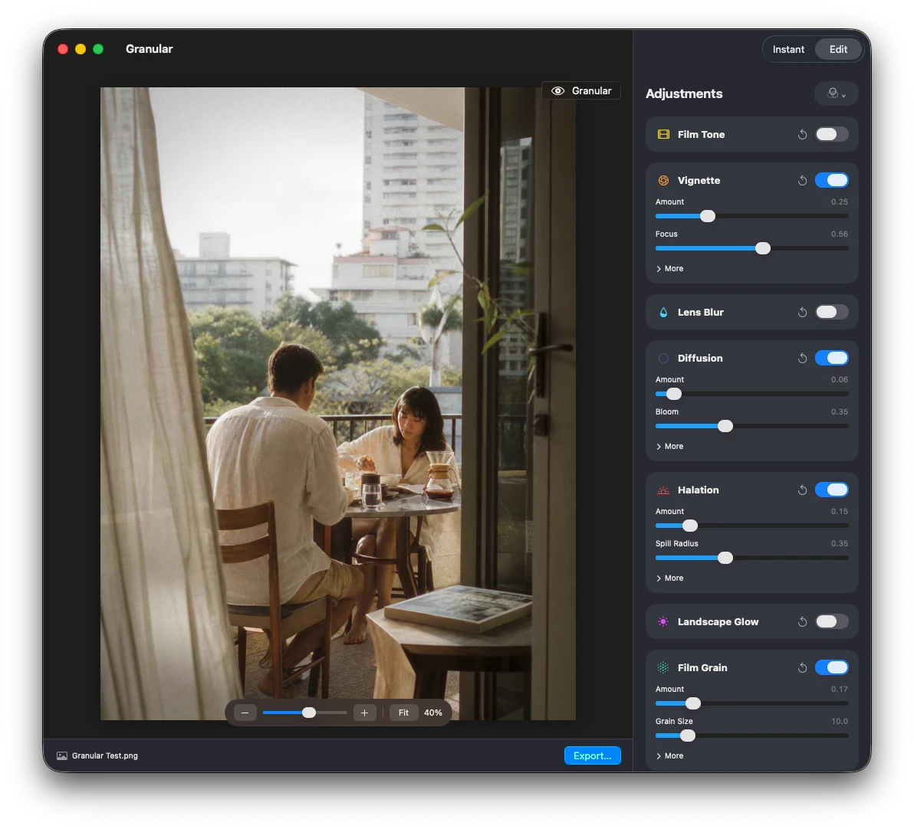

<p align="center"></p>

<h1 align="center">Granular</h1>

Granular is a native macOS app for giving still images a more photographic, film-like finish—quickly. It combines film tone, light shaping, lens diffusion, halation, and light-responsive grain in a focused workflow built for macOS.

<p align="center"></p>

## What it does

- **Instant mode** — a film-back interface: pick a recipe from the canister, drop images onto the film strip, and each one is processed and saved right away. An exposure counter tracks the frames you've shot.
- **Edit mode** — open an image, fine-tune the look with a live preview, inspect details at any zoom level, hold the eye button to compare against the original, then export. Switch between Instant and Edit from the toolbar.
- **Watched folders** — automatically process new images placed in a selected folder.
- **Recipes** — start with a small set of built-in looks, then save, rename, update, and delete your own in the recipe manager.
- **Film tone** — choose from curated color stocks and adjust exposure, contrast, saturation, vibrance, and warmth with a photographic response.
- **Optical and finishing effects** — shape the frame with vignette, imperfect edge-focused lens blur and prismatic RGB separation, Black Pro-Mist-style diffusion, restrained halation, detail-preserving landscape glow, and signal-dependent grain.

<p align="center"></p>

Granular processes JPEG, HEIC, PNG, and TIFF images. The rendering order is fixed:

`film tone → spotlight/vignette → lens blur → diffusion → halation → landscape glow → grain`

## Requirements

- macOS 26 or later
- Apple Silicon or an Intel Mac capable of running macOS 26

## Build from source

Granular currently ships as source. Building requires the full Xcode 26 application, including Icon Composer.

The easiest route is to double-click **Build Granular.command** in Finder. It creates the app at `dist/Granular.app` and reveals it when finished.

Or build from Terminal:

```sh
swift test
./Scripts/build-app.sh
open -R dist/Granular.app
```

Detailed setup and troubleshooting instructions are in [BUILDING.md](BUILDING.md).

## Credits and attribution

The three cinema stocks are baked from the MIT-licensed [spectral_film_lut](https://github.com/JanLohse/spectral_film_lut) model; the rest are parametric looks fitted to the author's own reference renderings. See [THIRD_PARTY_NOTICES.txt](Resources/THIRD_PARTY_NOTICES.txt) for details.

Film-stock and manufacturer names are descriptive only. Granular is not endorsed by or affiliated with their trademark owners.

## License

Copyright (c) 2026 Daniel McCullum.

Granular is free software: you can redistribute it and/or modify it under the terms of the [GNU General Public License](LICENSE) as published by the Free Software Foundation, either version 3 of the License, or (at your option) any later version. It is distributed in the hope that it will be useful, but without any warranty; see the license for details.

Bundled third-party components keep their original licenses.
